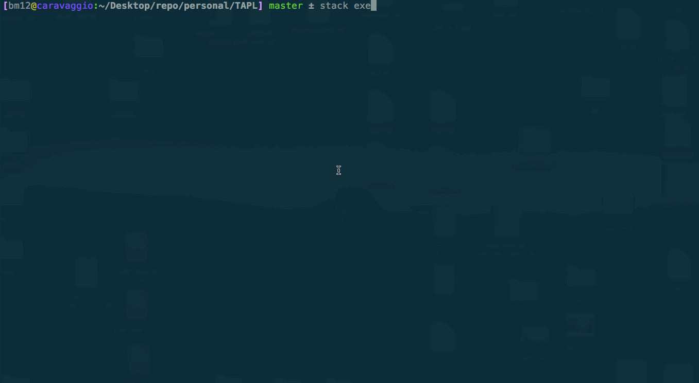
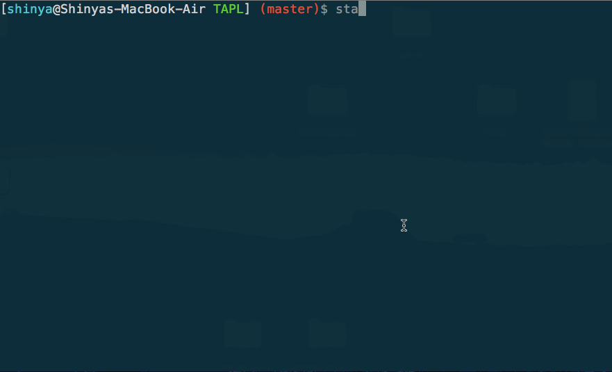

[](https://circleci.com/gh/waddlaw/TAPL)
[](https://app.netlify.com/sites/tapl/deploys)

# 型システム入門 プログラミング言語と型の理論

- [オーム社の公式ページ](https://www.ohmsha.co.jp/book/9784274069116/)
- [日本語版サポートページ](http://tapl.proofcafe.org/)
  - [正誤表](http://tapl.proofcafe.org/errata)
- [原著サポートページ](http://www.cis.upenn.edu/~bcpierce/)
  - [Errata](http://www.cis.upenn.edu/~bcpierce/tapl/index.html)

## スクリーンショット

型無し算術式



型無しλ計算



## Quick Start Guide

stack のバージョンは 2.1.1 以上を利用しましょう。

```shell
$ git clone https://github.com/waddlaw/TAPL.git
$ cd TAPL
$ stack run
```

## 開発

- [haddock](https://waddlaw.github.io/TAPL/)

### stack

```shell
$ stack test --fast --file-watch

## hoogle 生成
$ stack hoogle --keep-going

## haddock 生成
$ stack clean && stack haddock

## ベンチマーク
# all
$ stack bench --benchmark-arguments "--small"

# gauge
$ stack bench tapl:bench:gauge --benchmark-arguments "--small"

# criterion
$ stack bench tapl:bench:criterion --benchmark-arguments "--output bench.html"
```

### cabal

```shell
# package.yaml から cabal ファイルを生成するため
$ stack build --dry-run

# ビルド
$ cabal new-build

# テスト
$ cabal new-test all
```

### チェック

```shell
$ stack clean && stack test --fast --pedantic --file-watch
$ hlint .
```

stylish-haskell の適用

```shell
$ scripts/stylish.sh
```

### フォーマッター

```shell
$ ormolu -c ormolu.yaml --mode inplace <file>
```

フォーマッターのバグにより動作しないやつ

```shell
λ ormolu -c ormolu.yaml --mode inplace subs/lambda-fullsimple/src/Language/FullSimpleLambda/TypeCheck.hs
```

### ドキュメントの生成

[note/](./note) 以下のマークダウンファイルを編集してください。

```shell
# 初回のみ
$ mkdir _site

$ ./MkDoc
$ firefox _site/ch03.html
```

- [mmark](https://github.com/mmark-md/mmark)
- [mmark-ext](https://github.com/mmark-md/mmark-ext)
- [mmark-cli](https://github.com/mmark-md/mmark-cli)
- [mathjax](http://docs.mathjax.org/en/latest/)

## 実行方法

```shell
$ stack run proofb

$ stack run nb

$ stack run untyped-lambda
```
